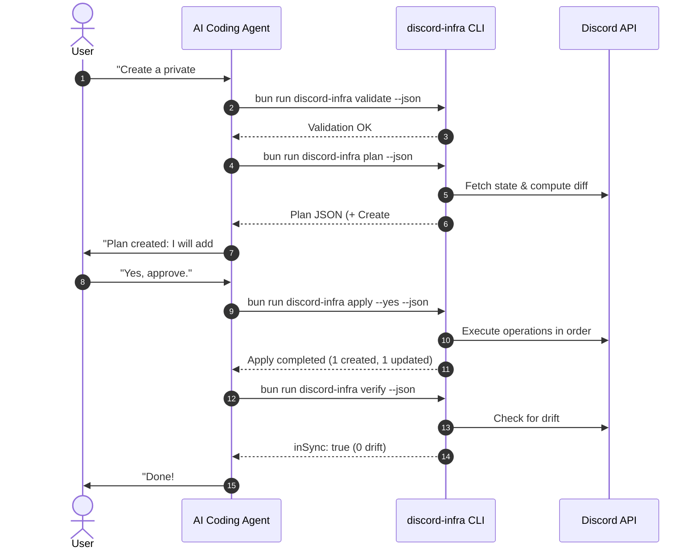

# AI Agent & MCP Integration Workflow

`discord-infra` is engineered specifically for autonomous AI coding agents (such as Codex, OpenCode, Claude Code, or Antigravity) and future Model Context Protocol (MCP) servers.

---

## 1. Principles for AI Agents

1. **Never Hallucinate Discord Snowflakes**:
   - The declarative schema identifies resources using logical names (`GM`, `COMMUNITY`, `general`).
   - The application automatically handles Discord ID lookups and resolution.
2. **Deterministic Diff Verification**:
   - Always run `plan --json` to inspect proposed actions before asking for execution.
3. **Always Run Verification**:
   - Always call `verify --json` after an apply operation to confirm live server state matches the YAML repository.

---

## 2. Standard AI Agent Workflow Loop



---

## 3. Programmatic & MCP Tool Interface

When exposing `discord-infra` via an MCP server or TypeScript script, use the exported functions in `src/index.ts`:

```typescript
import { getState, plan, apply, verify, exportInfrastructure, validate } from "discord-infra";

// 1. Validate local YAML files
const { valid, config } = validate({ configPath: "discord" });

// 2. Fetch live state
const state = await getState({ guildId: "1234567890" });

// 3. Generate side-effect free plan
const { plan: executionPlan } = await plan({ configPath: "discord" });

// 4. Apply changes
const result = await apply({
  configPath: "discord",
  autoApprove: true,
  allowDestructive: false,
});

// 5. Verify drift
const { verification } = await verify({ configPath: "discord" });
console.log(`In sync: ${verification.inSync}`);
```

---

## 4. MCP Tools Schema Mapping

| MCP Tool            | Corresponding Function          | Description                                                   |
| :------------------ | :------------------------------ | :------------------------------------------------------------ |
| `discord.get_state` | `getState(options)`             | Returns current roles, categories, and channels from Discord. |
| `discord.plan`      | `plan(options)`                 | Returns structured JSON diff of desired vs actual state.      |
| `discord.apply`     | `apply(options)`                | Applies planned operations with transaction tracking.         |
| `discord.verify`    | `verify(options)`               | Detects drift between live server and Git configuration.      |
| `discord.export`    | `exportInfrastructure(options)` | Exports existing Discord server into Git-ready YAML files.    |
| `discord.validate`  | `validate(options)`             | Validates syntax, schemas, and referential integrity offline. |
