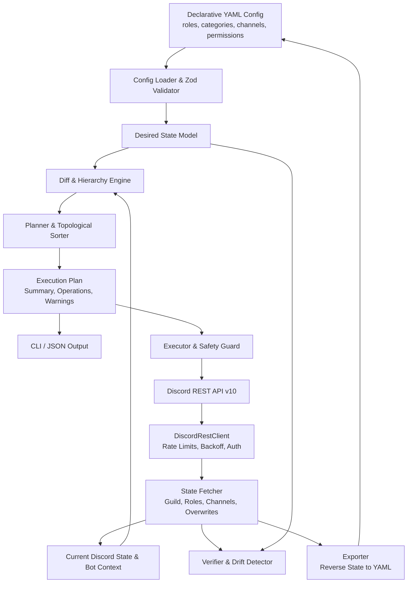

# Architecture Overview: `discord-infra`

`discord-infra` is a production-oriented Declarative Discord Infrastructure as Code manager built with Bun and strict TypeScript. It models Discord guilds as deterministic, Git-versioned infrastructure.

---

## High-Level Architecture

The system is organized into modular layers with unidirectional data flow and strict separation of concerns:

---

## Core Components

### 1. Configuration Layer (`src/config/`)

- **`types.ts`**: Pure TypeScript definitions for the declarative schema (Roles, Categories, Channels, Permissions).
- **`schema.ts`**: Zod schemas validating syntax, hex color formats (`#9B59B6`), Discord permission flag validity, and referential integrity (checking that channels reference declared categories and permission blocks reference declared roles).
- **`loader.ts`**: Supports both modular directory layouts (`roles.yaml`, `categories.yaml`, `channels.yaml`, `permissions.yaml`) and single-file configurations (`discord.yaml`).

### 2. Discord API & Client Layer (`src/discord/`)

- **`client.ts`**: Dedicated `DiscordRestClient` wrapping native Bun `fetch`.
  - Automatic token redaction from logs and error traces.
  - HTTP 429 rate limit parsing (`retry_after` header/body) with jittered sleep.
  - Exponential backoff for 5xx server errors and transient connection failures.
  - Complete REST resource mapping for guilds, roles, channels, positions, and permission overwrites.
- **`permissions.ts`**: Discord bitwise permission calculations using native `BigInt`. Converts between bitfield strings and human-readable permission maps (`{ view_channel: true, send_messages: false }`).
- **`hierarchy.ts`**: Evaluates bot guild membership, owner bypass, and role positions to enforce Discord's strict role hierarchy prior to execution.
- **`state.ts`**: Fetches the complete guild hierarchy and builds index maps for efficient querying.

### 3. Planner & Diff Engine (`src/planner/`)

- **`diff.ts`**: Computes granular differences between desired state and actual Discord state.
  - Matches resources primarily using stable logical names (`name`, `category + name`).
  - Supports optional `discord_id` for explicit overrides.
  - Detects resource creations, in-place property updates, category moves, permission changes, and deletions.
- **`operations.ts`**: Sorts operations into a deterministic dependency graph:
  1. Role Creations
  2. Role Updates
  3. Category Creations
  4. Category Updates
  5. Channel Creations
  6. Channel Updates & Category Moves
  7. Permission Overwrites (Categories first, then Channels)
  8. Permission Removals
  9. Ordering / Positions
  10. Destructive Deletions (Channels -> Categories -> Roles)
- **`planner.ts`**: Assembles the sorted operations, calculates statistics, checks for role hierarchy constraints, and renders human-readable or `--json` plan diffs.

### 4. Safe Executor (`src/executor/`)

- **`confirmation.ts`**: Enforces strict confirmation. Normal apply requires `[y/N]`. Destructive operations require explicitly typing `"DELETE"` interactively, or specifying `--allow-destructive --yes` in non-interactive CI pipelines.
- **`executor.ts`**: Executes planned operations in dependency order. Dynamically resolves Discord Snowflakes for newly created resources so subsequent operations receive the correct parent and role IDs. If any operation fails, execution halts immediately and reports exact progress. Rollback is never falsely reported.

### 5. Verifier & Drift Detector (`src/verifier/`)

- **`verifier.ts`**: Side-effect free engine that compares desired configuration with current live Discord state. Emits detailed drift reports with non-zero exit codes if live state has deviated from Git.

### 6. Exporter (`src/exporter/`)

- **`exporter.ts`**: Connects to an existing Discord guild, strips sensitive bot tokens or member metadata, and exports clean, readable declarative YAML files ready for version control.

---

## Extensibility

The architecture is designed to support future Discord features with zero breaking changes:

- Additional channel types (Voice channels, Stage channels, Announcement channels, Forum channels).
- Scheduled guild events, auto-moderation rules, and custom integrations.
- Agentic Model Context Protocol (MCP) tool exposure.
